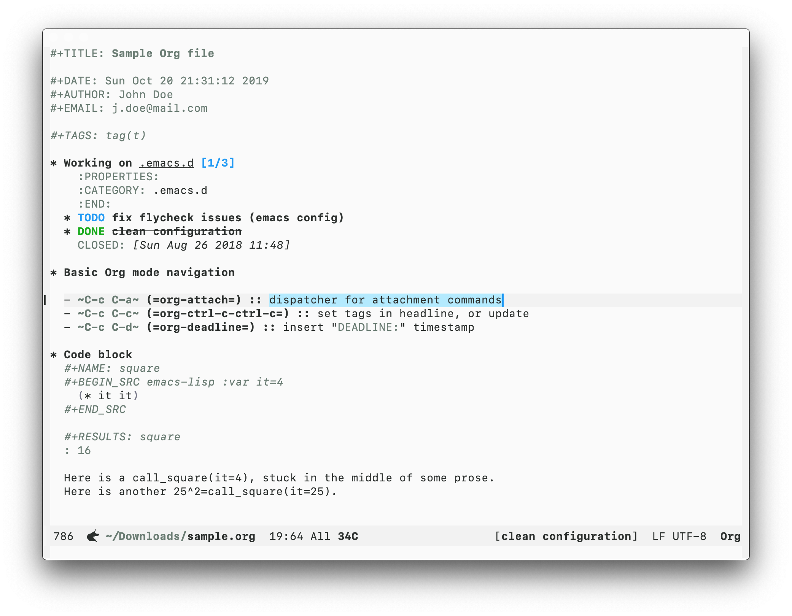
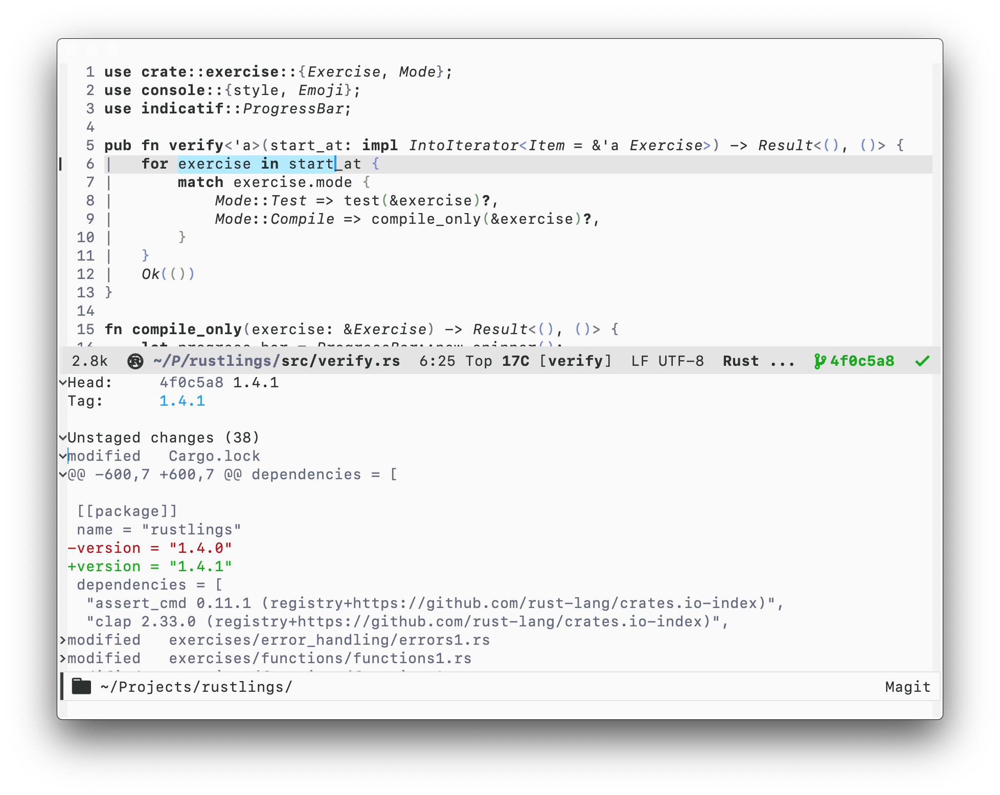

<p align="center"><a href="https://melpa.org/#/berrys-theme"></a></p>

# Berrys

> A light, clean and elegant theme for [Emacs](https://www.gnu.org/software/emacs/).




## Quickstart

##### MELPA

`M-x package-install <RET> berrys-theme`

#### Manually

Add the emacs theme files to `~/.emacs.d/themes`.

To load a theme add the following to your init.el

```
(add-to-list 'custom-theme-load-path "~/.emacs.d/themes")
(load-theme 'berrys t)
```

#### Use-package

```
(use-package berrys-theme
  :ensure t
  :config
  (load-theme 'berrys t)

  :config ;; for good measure and clarity
  (setq-default cursor-type '(bar . 2))
  (setq-default line-spacing 2))
```

<p align="center">Copyright &copy; 2019-present <a href="mailto:v8v.buzin@gmail.com">Slava Buzin</a></p>

<p align="center"><a href="https://github.com/vbuzin/berrys-theme/blob/master/LICENSE"></a></p>
